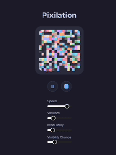

# Pixilation

A mesmerizing pixel animation experiment created with Next.js and Catppuccin colors. Watch as pixels dance and transform, creating beautiful patterns that you can control.



## Features

- 🎨 Beautiful Catppuccin color palette
- ✨ Smooth pixel animations
- 🎮 Interactive controls:
  - Play/Pause animation
  - Color picker with rainbow palette
  - Speed control
  - Animation variation settings
  - Visibility chance adjustment
- 🌈 Special completion animation with glowing border
- 🎯 Click to lock pixels in place
- 📱 Responsive design

## Tech Stack

- Next.js 14
- TypeScript
- Tailwind CSS
- Zustand for state management
- shadcn/ui components
- Catppuccin color scheme

## Development

```bash
# Install dependencies
npm install

# Run development server
npm run dev
```

## Credits

This project was created using [Cursor](https://cursor.sh), an AI-powered code editor. The development process was a collaboration between human creativity and AI assistance, showcasing the potential of AI-augmented development.

## License

MIT License - feel free to use this code for your own projects!
